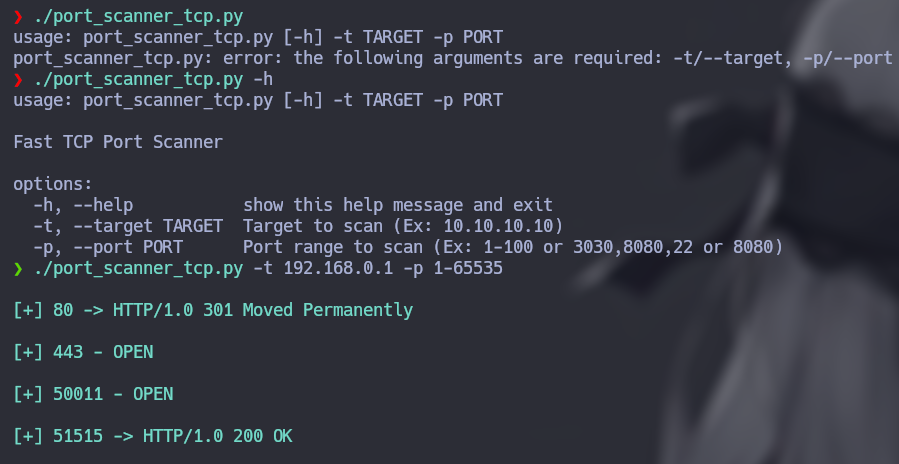

# TCP Port Scanner

    

**TCP Port Scanner** is a fast tool to scan open ports. You can use it giving the **target host** and **port**.

    

## How can I use it?

- **Target:**
    First, you need to give a target using **-t / --target** argument. 
    Example: -t 192.168.0.1

- **Port:**
    Second, you need to give a specific, range or list of ports using **-p / --port** argument. 
    Examples:

    - **-p 80**
    - **-p 22,80,443,8080**
    - **-p 1-600 (Scan from 1 to 600)**

- **Target is UP?**
    Third, you can select if it's necessary verify if you can communicate with target host. By default the program check it, but you can use 'no' using **-tU / --target-up**.

    - **-tU 'yes'**
    - **-tU 'no'**

- **Protocol**
    Fourth, you can select a protocol to scan target hosts. There are two, **TCP** that's the default value or **UDP**. You can select UDP using **-P / --port**

    - **-P 'TCP'**
    - **-P 'UDP'**
